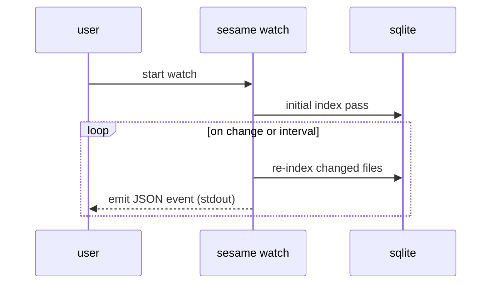

# CLI usage

## Commands

```bash
sesame index
sesame index --full
sesame search <query> [options]
sesame status
sesame watch
sesame watch --interval <seconds>
```

All commands operate on the same SQLite index database (`index.sqlite`).

## `sesame index`

Builds/updates the local index from configured session sources.

- default: incremental (mtime-based)
- `--full`: drop DB content and rebuild everything

Examples:

```bash
sesame index
sesame index --full
```

## `sesame search`

Searches indexed chunks with SQLite FTS5 + BM25, then returns best chunks grouped by session.

Usage:

```bash
sesame search "query" [options]
```

Options:

- `--cwd <path>`: filter sessions by cwd prefix
- `--after <date>`: filter by created_at >= date
- `--before <date>`: filter by created_at <= date
- `--limit <n>`: max results (default 10)
- `--tools`: only tool_call chunks
- `--tool <name>`: specific tool name
- `--path <file>`: restrict to tool_call chunks mentioning a path
- `--exclude <id>`: exclude a session id (repeatable)
- `--json`: JSON output

Date formats:
- relative: `7d`, `2w`, `1m`
- absolute: `YYYY-MM-DD`

Special query:

```bash
sesame search "*" --limit 20
```

`"*"` bypasses FTS and lists sessions by `modified_at DESC`, still honoring filters.

Examples:

```bash
sesame search "nix infra simplify"
sesame search "publish workflow" --after 2w --limit 5
sesame search "package.json exports" --tools --tool write
sesame search "*" --cwd /Users/me/code --exclude abc --exclude def
sesame search "deploy" --json
```

## `sesame status`

Shows index stats:

- session count
- chunk count
- DB size
- last sync timestamp
- DB location

## `sesame watch`

Runs one initial index pass, then keeps re-indexing on file changes (or interval) and emits JSON events.

Modes:
- default: filesystem watch + debounce
- `--interval <seconds>`: polling mode

Outputs:
- stderr: human logs
- stdout: JSON events (machine-readable)


