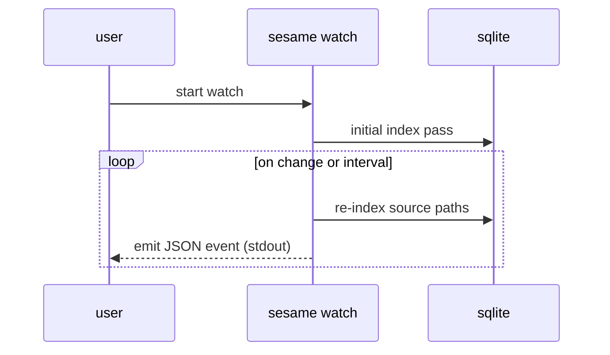

# CLI usage

## Commands

```bash
sesame index
sesame index --full
sesame search [query] [options]
sesame skills [options]
sesame status
sesame watch
sesame watch --interval <seconds>
```

All commands use the same local SQLite database: `<data-dir>/index.sqlite`. By default, the data directory is `~/.local/share/sesame` on macOS/Linux. You can override it with `SESAME_DATA_DIR`, or through the XDG variables used by `getXDGPaths()`.

Configuration lives at `<config-dir>/config.jsonc`, normally `~/.config/sesame/config.jsonc`. If it does not exist, Sesame creates:

```json
{
  "piSessionPaths": ["~/.pi/agent/sessions"]
}
```

## Global options

- `sesame --help` / `sesame -h` / `sesame help` / bare `sesame`: print full usage to stdout and exit 0.
- `sesame <command> --help` / `sesame <command> -h`: print usage for that command to stdout and exit 0.
- `sesame --version` / `sesame -V`: print the CLI version (from `packages/cli/package.json`) and exit 0. Also works after a command, e.g. `sesame search --version`.
- Unknown command: print an error and full usage to **stderr** and exit 1.
- Unknown flags and missing flag values fail loudly with an error to **stderr** and exit 1.

## `sesame index`

Builds or updates the local index from configured Pi session paths.

- default: incremental, using each session file's mtime
- `--full`: drops Sesame tables/triggers/indexes, recreates the schema, and indexes again
- indexes `.jsonl` files directly under each configured root and one directory below it, matching Pi's encoded-cwd session layout
- takes an index lock so concurrent index/watch runs do not write at the same time
- updates `metadata.last_sync_at` only when the run has no errors and adds or updates at least one session

Examples:

```bash
sesame index
sesame index --full
```

## `sesame search`

Searches indexed chunks with SQLite FTS5 + BM25, then returns the best matching chunk per session.

Usage:

```bash
sesame search [query] [options]
```

Options:

- `--cwd <path>`: filter sessions by `cwd` prefix
- `--after <date>`: filter by `modified_at >= date`
- `--before <date>`: filter by `modified_at <= date`
- `--limit <n>`: max results (default: 10)
- `--tools`: search only assistant tool-call chunks
- `--tool <name>`: search a specific tool name
- `--path <file>`: restrict matches to tool-call chunks whose formatted content mentions a path
- `--skill <text>`: sessions that used a skill. An exact name match (case-insensitive) filters to that skill; otherwise the text is resolved fuzzy against the skill catalog (name + description) and sessions using any matched skill are returned. An unmatched query returns nothing.
- `--skill-path <substring>`: only sessions that used a skill whose `SKILL.md` path contains the substring; combining it with `--skill` requires both to match the same skill
- `--arg <tool:key=value>`: only sessions where `tool` was called with parameter `key` containing `value` (repeatable, AND across filters; validation fails loudly for tools/keys outside the allowlist: `bash:command`, `read/write/edit:path`, `find/grep:pattern,path`, `ls:path`, `find_sessions:query,cwd`, `list_sessions:cwd`, `read_session:goal`, `read_url:url`, `synthetic_web_search:query`, `process:action,name`)
- `--exclude <id>`: exclude a session id; repeatable
- `--json`: output JSON

Date formats:

- relative: `7d`, `2w`, `1m`
- absolute: `YYYY-MM-DD` or another ISO-like date string beginning with `YYYY-MM-DD`

Notes:

- Query tokens are escaped and quoted before FTS matching, so punctuation is treated as search text rather than FTS syntax.
- CLI scores are display-normalized. Ranking still comes from SQLite FTS5 BM25, where lower raw scores are better.
- Multiple query terms first require all terms. If filters leave no all-term results, Sesame retries with any-term matching and reports the mode in `matchMode`.
- Omit the query, pass an empty query, or use `"*"` to browse sessions by `modified_at DESC`.
- `status` filtering exists in the library API, not as a CLI flag.

Special query:

```bash
sesame search "*" --limit 20
```

`"*"` bypasses FTS and lists sessions by `modified_at DESC`, still honoring filters. With `--tools` or `--tool`, it joins chunks so tool filters still apply.

Examples:

```bash
sesame search "nix infra simplify"
sesame search "publish workflow" --after 2w --limit 5
sesame search "package.json exports" --tools --tool write
sesame search --cwd /Users/me/code --exclude abc --exclude def
sesame search "deploy" --json
sesame search "*" --skill vitest
sesame search "flaky test" --skill-path /skill-library/
```

JSON output has this shape:

```json
{
  "query": "deploy",
  "resultCount": 1,
  "results": [
    {
      "sessionId": "...",
      "source": "pi",
      "path": ".../session.jsonl",
      "cwd": "/Users/me/code/project",
      "name": "Session name",
      "score": 0.42,
      "created": "2026-05-08T12:00:00.000Z",
      "modified": "2026-05-08T12:00:00.000Z",
      "matchedSnippet": "...",
      "matchMode": "all",
      "matchedType": "message",
      "matchedEntryId": "...",
      "matchedAt": "2026-05-08T12:00:00.000Z",
      "skills": ["vitest"]
    }
  ]
}
```

## `sesame skills`

Lists skills used across indexed sessions, grouped by skill name and ordered by session count. Useful for finding the exact name to pass to `sesame search --skill`.

Options:

- `--cwd <path>`: only count sessions whose `cwd` starts with this path
- `--after <date>` / `--before <date>`: same date handling as `search`
- `--actor <kind>`: `user` (skill injected by a user action: `/skill:name` slash command or `?name` autocomplete) or `agent` (`SKILL.md` read via a tool)
- `--limit <n>`: max rows (default: 100, capped at 1000)
- `--json`: output JSON

Examples:

```bash
sesame skills
sesame skills --after 1m --actor user
sesame skills --cwd /Users/me/code --json
```

JSON output:

```json
{
  "skillCount": 1,
  "skills": [
    {
      "name": "vitest",
      "sessionCount": 9,
      "actors": ["agent", "user"],
      "details": [
        { "actor": "agent", "details": [null] },
        { "actor": "user", "details": ["autocomplete", "slash"] }
      ],
      "paths": ["/Users/me/skills/vitest/SKILL.md"]
    }
  ]
}
```

## `sesame status`

Shows index stats:

- session count
- chunk count
- database size
- last successful sync timestamp
- database location

## `sesame watch`

Runs one initial index pass, then keeps re-indexing configured paths.

Modes:

- default: `fs.watch(..., { recursive: true })` with a 500 ms debounce per source path
- `--interval <seconds>`: polling mode, re-indexing all configured sources on that interval

Outputs:

- stderr: human-readable logs
- stdout: JSON events, one event per indexed source

Example stdout event:

```json
{"timestamp":"2026-05-08T12:00:00.000Z","path":"/Users/me/.pi/agent/sessions","added":1,"updated":0,"skipped":42,"errors":0}
```


```mermaid
sequenceDiagram
  participant U as user
  participant W as sesame watch
  participant DB as sqlite

  U->>W: start watch
  W->>DB: initial index pass
  loop on change or interval
    W->>DB: re-index source paths
    W-->>U: emit JSON event (stdout)
  end
```
