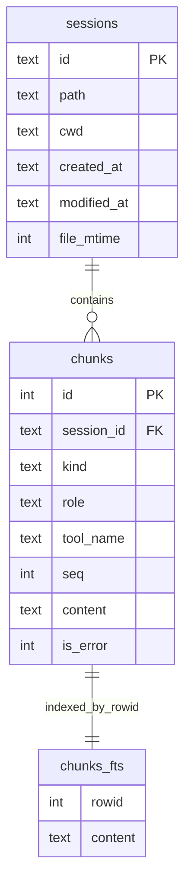

# Indexing internals

## Overview

Indexing converts session files into normalized records in SQLite:

- `sessions` table: metadata + mtime
- `chunks` table: searchable units (`message` and `tool_call`)
- `chunks_fts` table: FTS5 index on chunk content

Flow:
1. Load config sources (`~/.config/sesame/config.jsonc` by default)
2. Scan source directories
3. Parse session files (`pi` parser)
4. Build chunks
5. Upsert via delete + insert per changed session

```mermaid
flowchart TD
  A[sesame index] --> B[load config]
  B --> C[scan source directories]
  C --> D{mtime changed?}
  D -- no --> E[skip file]
  D -- yes --> F[parse JSONL with PiParser]
  F --> G[build message/tool_call chunks]
  G --> H[replace session rows (delete+insert)]
  H --> I[insert session + chunks]
  I --> J[FTS triggers sync chunks_fts]
  J --> K[update last_sync_at when run has changes and no errors]
```

## Incremental strategy

`src/indexer/index.ts` uses file mtime:

- reads file first line for session id
- compares current mtime vs stored `sessions.file_mtime`
- unchanged => skip
- changed/new => parse and rewrite that session

This keeps index fast for large session directories.

## Parsing (`PiParser`)

`src/parsers/pi.ts` extracts:

- session header (`id`, `cwd`, `timestamp`)
- optional session name (`session_info`)
- user/assistant text messages
- assistant tool calls
- `toolResult` messages (`toolName`, `isError` if present)
- `bashExecution` messages
- compaction summaries

Ignored lines:
- model/thinking level metadata lines

## Chunking

### Message chunks

One chunk per non-empty turn text:

- `kind = "message"`
- `role = user|assistant|system`
- `content = turn.textContent`
- `is_error` set for parsed tool result turns when available

### Tool-call chunks

One chunk per assistant tool call:

- `kind = "tool_call"`
- `tool_name = tool call name`
- `content` formatted by `src/indexer/format-tool-call.ts`

Formatter includes tool-specific fields (path/content/command/result/etc.) to make file and command searches work.

## Database sync

FTS table is external-content (`content='chunks'`) and kept in sync through SQL triggers:

- insert trigger
- update trigger
- delete trigger



Also present (not shown above):
- `metadata` for values like `last_sync_at`
- `schema_migrations` for migration tracking

## Full rebuild

`sesame index --full` calls `dropAll()` then re-runs indexing.

`dropAll()`:
- drops triggers/indexes/tables
- recreates schema
- marks migrations applied for fresh schema

## Metadata

Indexing updates `metadata.last_sync_at` when run has:
- zero errors
- at least one added or updated session
