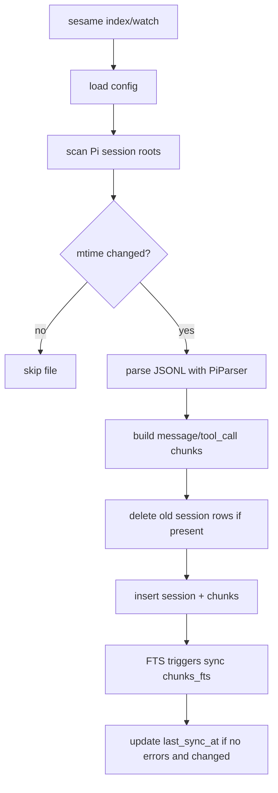
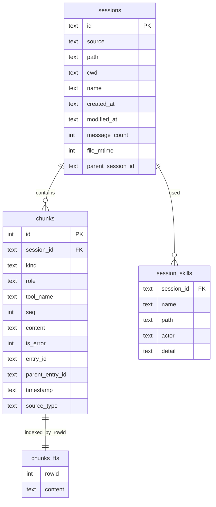

# Indexing internals

## Overview

Indexing converts Pi JSONL session files into normalized SQLite records:

- `sessions`: one row per session, with metadata, source path, cwd, timestamps, mtime, and parent session id
- `chunks`: searchable units derived from messages, assistant tool calls, titles, and checkpoints
- `chunks_fts`: external-content FTS5 table over `chunks.content`
- `session_skills`: one row per skill a session used, for skill filtering
- `metadata`: key/value state such as `last_sync_at`
- `schema_migrations`: applied migration tracking

Flow:

1. Load config from `<config-dir>/config.jsonc`, key `piSessionPaths`.
2. Expand `~` in configured paths.
3. Scan each Pi session root.
4. Parse candidate `.jsonl` files with `PiParser`.
5. Build `message`, `tool_call`, and metadata chunks, plus `session_skills` rows.
6. Replace changed sessions with delete + insert in one transaction.
7. Let SQL triggers keep `chunks_fts` synchronized.
8. Update `metadata.last_sync_at` when the run has changes and zero errors.


```mermaid
flowchart TD
  A[sesame index/watch] --> B[load config]
  B --> C[scan Pi session roots]
  C --> D{mtime changed?}
  D -- no --> E[skip file]
  D -- yes --> F[parse JSONL with PiParser]
  F --> G[build message/tool_call chunks]
  G --> H[delete old session rows if present]
  H --> I[insert session + chunks]
  I --> J[FTS triggers sync chunks_fts]
  J --> K[update last_sync_at if no errors and changed]
```

## File discovery

`packages/sesame/indexer/index.ts` scans each configured root and recurses exactly one level into child directories. This matches Pi's current layout:

```text
~/.pi/agent/sessions/<encoded-cwd>/<session-id>.jsonl
```

Files are considered only if `PiParser.canParse()` accepts them. That requires:

- `.jsonl` extension
- first line parses as JSON
- first line has `type: "session"`

Unreadable subdirectories and unparseable files are skipped. Per-file parse/index failures are logged and counted as errors without aborting the whole run.

## Incremental strategy

Sesame uses file mtime for incremental indexing:

- reads the first line to get the session id cheaply
- compares current mtime with `sessions.file_mtime`
- unchanged files are skipped
- new or changed files are fully parsed
- changed sessions are deleted first, then inserted with fresh chunks

This keeps indexing fast for large session directories while keeping FTS state consistent through delete triggers.

## Parsing (`PiParser`)

`packages/sesame/parsers/pi.ts` extracts:

- session header: `id`, `cwd`, `timestamp`
- parent session id from `parentSession`, by extracting the UUID from the referenced path
- current session name from the final `session_info.name`; blank names clear it
- active checkpoint labels, resolved to their target entry metadata; blank or omitted labels remove a checkpoint
- user text messages
- assistant text messages
- assistant `toolCall` blocks as structured `ToolCall` objects
- `toolResult` messages as system turns, including `toolName` and `isError`
- `bashExecution` messages as system turns containing `$ <command>` plus output
- `custom_message` entries as searchable system turns prefixed with `[customType]`
- `compaction` summaries
- `branch_summary` summaries
- `custom_message.details`, kept as `Turn.details` so structured hook payloads stay usable
- skill usage, derived from turns (see below) and returned as `ParsedSession.skills`

Skipped entries:

- `model_change`
- `thinking_level_change`
- `custom`
- image and thinking content blocks inside messages, because only text blocks are indexed today

Malformed JSONL lines are warned and skipped; parsing continues for the rest of the file.

## Chunking

### Message chunks

One chunk is created for each turn with non-empty `textContent`:

- `kind = "message"`
- `role = user|assistant|system`
- `content = turn.textContent`
- `tool_name` is set for tool-result turns
- `is_error` is set for tool-result turns when available
- `entry_id`, `parent_entry_id`, `timestamp`, and `source_type` preserve Pi's tree metadata

### Tool-call chunks

One chunk is created for each assistant tool call:

- `kind = "tool_call"`
- `tool_name = tc.name`
- `role = null`
- `content` is generated by `packages/sesame/indexer/format-tool-call.ts`
- tree metadata is inherited from the assistant turn that made the call

Formatter behavior:

- write/create tools: tool name, path, content, optional result
- edit tools: tool name, path, old text, new text, optional result
- bash/shell/run_command: tool name, command, optional output
- read tools: tool name, path, optional content
- generic tools: tool name, serialized args, optional result

Pi assistant tool-call chunks usually do not have results attached today; tool results are indexed separately as message chunks.

### Metadata chunks

The final session title and each active checkpoint are searchable metadata chunks:

- `kind = "metadata"`, `source_type = "session_info"`, `content = "session: <title>"`
- `kind = "metadata"`, `source_type = "label"`, `content = "checkpoint: <label>"`

Checkpoint chunks retain the labeled target's `entry_id`, parent entry id, and timestamp.

### Skill rows

`packages/sesame/parsers/detect-skills.ts` derives skill usage from a session's turns and writes it to `session_skills`. Each row records who loaded the skill (`actor`) and, for user invocations, how (`detail`). Three signals are recognized:

- `actor = "user"`, `detail = "slash"`: a `<skill name="..." location="...">` block at the very start of a user message. Pi core inlines this block when the user types `/skill:name`.
- `actor = "user"`, `detail = "autocomplete"`: a `custom_message` with `customType: "skill-invocation"`, produced by the `skill-autocomplete` hook when a `?skill-name` reference is expanded. Name and path come from the entry's `details`, falling back to the `<skill name="..." location="...">` opening tag in the content.
- `actor = "agent"`, `detail = null`: a read tool call (`read`, `read_file`, `view`, `cat`) whose path argument points at a `SKILL.md` file. This covers skills the agent loads from the system prompt listing. The skill name is the containing directory, so `/skills/vitest/SKILL.md` yields `vitest`.

Rows are de-duplicated on name + path + actor + detail, so a skill both invoked and read produces two rows. Reads of other files inside a skill directory are ignored.

Migration `005` adds the `actor` and `detail` columns to existing databases and backfills `actor` from the legacy `source` column (`invocation` -> `user`, `read` -> `agent`); `detail` stays `NULL` for old rows. The `source` column is left in place but no longer read.

Tool-result bodies for `find_sessions`, `list_sessions`, and `read_session` are excluded to prevent prior session-search output from polluting the index. Their assistant tool-call arguments remain searchable.

## Search behavior

Normal queries are tokenized by whitespace, each token is quoted, and then SQLite FTS5 matches against `chunks_fts`. This avoids accidental FTS operator syntax from punctuation in user queries.

Search joins matching chunks to sessions, applies filters, groups by session, keeps the best-scoring chunk per session, sorts by BM25 score ascending, and applies `limit`. Multi-term searches first require all terms. If no filtered results remain, Sesame retries with any-term matching. Results report `matchMode` as `"all"`, `"any"`, or `"browse"`.

An omitted, empty, or `"*"` query bypasses FTS and lists sessions by `modified_at DESC`. It still honors session filters, exclude filters, and tool filters where applicable. Date filters always compare `sessions.modified_at`.

The `skill` and `skillPath` filters apply as a single `EXISTS` subquery against `session_skills`, so they compose with FTS matching, tool filters, and browse mode without changing which chunk is reported as the match. `skill` matches the name exactly (`COLLATE NOCASE`); `skillPath` matches the `SKILL.md` path as an escaped `LIKE '%...%'` substring, so `%` and `_` are literals. Passing both requires one `session_skills` row to satisfy both predicates, meaning "this skill, loaded from this path".

## Database schema


```mermaid
erDiagram
  sessions ||--o{ chunks : contains
  sessions ||--o{ session_skills : used
  chunks ||--|| chunks_fts : indexed_by_rowid

  sessions {
    text id PK
    text source
    text path
    text cwd
    text name
    text created_at
    text modified_at
    int message_count
    int file_mtime
    text parent_session_id
  }

  chunks {
    int id PK
    text session_id FK
    text kind
    text role
    text tool_name
    int seq
    text content
    int is_error
    text entry_id
    text parent_entry_id
    text timestamp
    text source_type
  }

  session_skills {
    text session_id FK
    text name
    text path
    text actor
    text detail
  }

  chunks_fts {
    int rowid
    text content
  }
```

Indexes currently include:

- `idx_chunks_session`
- `idx_chunks_kind`
- `idx_chunks_tool`
- `idx_sessions_parent`
- `idx_chunks_entry`
- `idx_session_skills_session`
- `idx_session_skills_name`
- `idx_session_skills_path`
- `idx_session_skills_actor` (created after migrations run, since migration `005` adds the `actor` column)

## Database sync

`chunks_fts` uses `content='chunks'` and is kept in sync through triggers:

- `chunks_ai` after insert
- `chunks_ad` after delete
- `chunks_au` after update

`openDatabase()` enables WAL mode and foreign keys, creates the latest schema if needed, runs pending migrations for existing databases, and ensures post-migration indexes.

## Full rebuild

`sesame index --full` calls `dropAll()` before indexing.

Migration 4 (`session_skills`) resets `sessions.file_mtime` to `-1`, so a plain `sesame index` re-parses everything once and backfills skill rows. A full rebuild is not required for skills.

Run a full rebuild after upgrading to populate title/checkpoint metadata and remove previously indexed session-discovery result bodies:

```bash
sesame index --full
```

`dropAll()`:

- drops FTS triggers
- drops chunk and skill indexes
- drops `chunks_fts`, `chunks`, `session_skills`, `sessions`, `metadata`, and `schema_migrations`
- recreates the current schema
- records all migrations as applied for the fresh schema

## Metadata

Indexing and watch mode update `metadata.last_sync_at` only when:

- total errors are zero
- at least one session was added or updated
